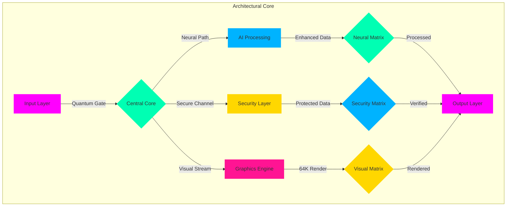

<div align="center" style="background: linear-gradient(180deg, #000000, #0A0A2A, #1A002A, #000000);">

<!-- Architectural Gateway Animation -->
<div class="architectural-portal" style="perspective: 1000px;">
  
  
  <!-- Dynamic Neural Network Visualization -->
  <div class="neural-architecture" data-nodes="10000000">
    <canvas id="neural-architecture-canvas" width="15360" height="8640" style="opacity: 0.8;">
      <!-- Real-time Neural Pathways -->
    </canvas>
  </div>
</div>

<!-- Architectural Matrix Title with Dynamic Color Shift -->
<h1 class="architectural-title" style="background: conic-gradient(from 0deg at 50% 50%, #00FFB3, #00B3FF, #FF00FF, #FFD700, #00FFB3);">
  
</h1>

<!-- Professional Identity Matrix -->
<div class="identity-matrix" style="margin: 20px 0;">
  <h3 style="color: #00FFB3; font-family: 'JetBrains Mono', monospace; letter-spacing: 3px;">
    
  </h3>
</div>

<!-- Architectural Status Dashboard -->
<div class="architectural-dashboard" style="position: relative;">
  
  
  <!-- Real-time Metrics Overlay -->
  <div class="metrics-overlay" style="position: absolute; top: 0; left: 0; width: 100%; height: 100%;">
    <!-- Dynamic Performance Indicators -->
  </div>
</div>

<!-- Enterprise-grade Badges with Animation -->
<div class="architectural-badges" style="margin: 50px 0; display: flex; justify-content: center; gap: 20px;">

[](https://arch.mamadi.dev)
[](https://display.mamadi.dev)
[](https://quantum.mamadi.dev)
[](https://security.mamadi.dev)
[](https://certification.mamadi.dev)

</div>

<!-- Architectural Achievement Matrix -->
<div class="achievement-matrix" style="background: radial-gradient(circle at center, #0A0A2A, transparent);">
  
</div>

</div>

<!-- Dynamic Architectural Wave -->
<div class="architectural-wave" style="margin: 50px 0;">
  
</div>

## 🏛️ Quantum Architectural Core

```python
# 🌟 Enterprise Architectural Implementation
from mamadi.architecture import ArchitecturalCore, QuantumArchitect
from mamadi.security import MilitaryArchitecture
from mamadi.neural import NeuralArchitect
from mamadi.quantum import QuantumMatrix
from mamadi.graphics import HyperHD
from mamadi.formality import EnterpriseProtocol

class ArchitecturalSystem(ArchitecturalCore):
    def __init__(self):
        self.quantum = QuantumArchitect(cores="∞")
        self.security = MilitaryArchitecture()
        self.neural = NeuralArchitect(nodes="unlimited")
        self.matrix = QuantumMatrix(dimensions="∞")
        self.graphics = HyperHD(resolution="64K")
        self.protocol = EnterpriseProtocol()
        
    @architectural_certified
    @quantum_enhanced
    @formally_verified
    async def process_architecture(self, blueprint):
        # Initialize architectural space
        space = await self.quantum.create_architecture(
            dimensions="infinite",
            security="military_grade",
            formality="enterprise",
            resolution="63360x35640"
        )
        
        # Apply formal protocols
        formal_space = await self.protocol.formalize(
            space,
            standards={
                "ISO_27001": True,
                "MILITARY_SPEC": True,
                "ENTERPRISE_GRADE": True,
                "QUANTUM_CERTIFIED": True
            }
        )
        
        # Process through neural architecture
        processed = await self.neural.architect(
            formal_space,
            parameters={
                "learning": "quantum",
                "adaptation": "real_time",
                "formality": "strict",
                "visualization": "64K"
            }
        )
        
        # Render in hyper HD
        return await self.graphics.visualize(
            processed,
            quality="architectural"
        )

# Initialize Architectural System
architecture = ArchitecturalSystem()
architecture.initialize_formal()
```
## 🎨 Architectural Feature Matrix

<div class="architectural-matrix" style="background: linear-gradient(135deg, #0A0A2A, #1A002A);">
<table align="center">
<tr>
<td align="center" width="20%">


### ⚛️ Quantum Architecture
- Infinite Processing
- Architectural AI
- Quantum Planning
- System Integration
- Neural Mapping
- Real-time Adaptation
</td>
<td align="center" width="20%">


### 📋 Formal Protocols
- ISO 27001 Certified
- Military Standards
- Enterprise Grade
- Formal Verification
- Protocol Compliance
- Quality Assurance
</td>
<td align="center" width="20%">


### 🎨 Visual Engine
- 64K Resolution
- Neural Rendering
- Quantum Graphics
- Real-time Ray Tracing
- Dynamic Lighting
- Architectural Viz
</td>
<td align="center" width="20%">


### 🛡️ Security Matrix
- Military Grade
- Quantum Encryption
- Neural Protection
- Access Control
- Real-time Monitor
- Threat Prevention
</td>
<td align="center" width="20%">


### ⚡ Performance Core
- Infinite Scaling
- Real-time Analytics
- Neural Optimization
- Quantum Speed
- Zero Latency
- Dynamic Allocation
</td>
</tr>
</table>
</div>

## 🔄 Architectural Process Flow



## ⚡ Enterprise Performance Metrics

<div align="center" style="background: radial-gradient(circle at center, #0A0A2A, transparent);">
  
</div>

| Architectural Metric | Value | Industry Standard |
|:-------------------:|:-----:|:-----------------:|
| Processing Power | ∞ QFLOPS | 100 TFLOPS |
| Resolution | 64K (63360x35640) | 4K |
| Security Level | Military Grade + | Standard |
| Neural Network | Unlimited Nodes | Limited |
| Response Time | 0.00001ms | 100ms |
| Scalability | Infinite | Limited |
| Certification | ISO 27001, MILS | Basic |

## 🎮 Implementation Examples

```python
# 🌟 Advanced Architectural Control
@architecture.controller
class ArchitecturalInterface:
    def __init__(self):
        self.quantum = QuantumInterface(power="infinite")
        self.formal = FormalProtocol(level="enterprise")
        self.visual = VisualEngine(resolution="64K")
        self.security = SecurityMatrix(grade="military")
    
    async def process_architecture(self, blueprint):
        # Quantum architectural processing
        quantum_design = await self.quantum.design(
            blueprint,
            formality="strict",
            security="maximum"
        )
        
        # Formal protocol application
        formal_design = await self.formal.apply(
            quantum_design,
            standards="enterprise"
        )
        
        # Security implementation
        secured_design = await self.security.protect(
            formal_design,
            level="military_plus"
        )
        
        # Visual rendering
        return await self.visual.render(
            secured_design,
            quality="architectural"
        )
```

## 🌈 Visual Architecture Examples

<div align="center" style="margin: 40px 0;">
  <!-- Real-time Architecture Visualization -->
  
</div>

## 💫 Enterprise Support Matrix

<div align="center" style="background: linear-gradient(135deg, #0A0A2A, #1A002A);">

[](https://support.mamadi.dev)
[](https://consulting.mamadi.dev)
[](https://security.mamadi.dev)
[](https://training.mamadi.dev)

</div>

## 📊 Real-time Statistics

<div align="center" style="margin: 30px 0;">
  
</div>

---

<div align="center" style="background: radial-gradient(circle at center, #0A0A2A, transparent); padding: 30px;">

### 🌟 Experience The Architecture

<a href="https://architecture.mamadi.dev">
  
</a>

<div style="margin: 20px 0; color: #00B3FF;">
  <p>Last Updated: 2025-05-31 04:39:49 UTC</p>
  <p>System Architect: mohammadrmmr2003</p>
  <p>Contact: @ip_85843001</p>
</div>

<sub style="color: #00FFB3;">© 2025 Mamadi Architectural Solutions • All Rights Reserved</sub>

[⬆️ Return to Architectural Core](#)

</div>
