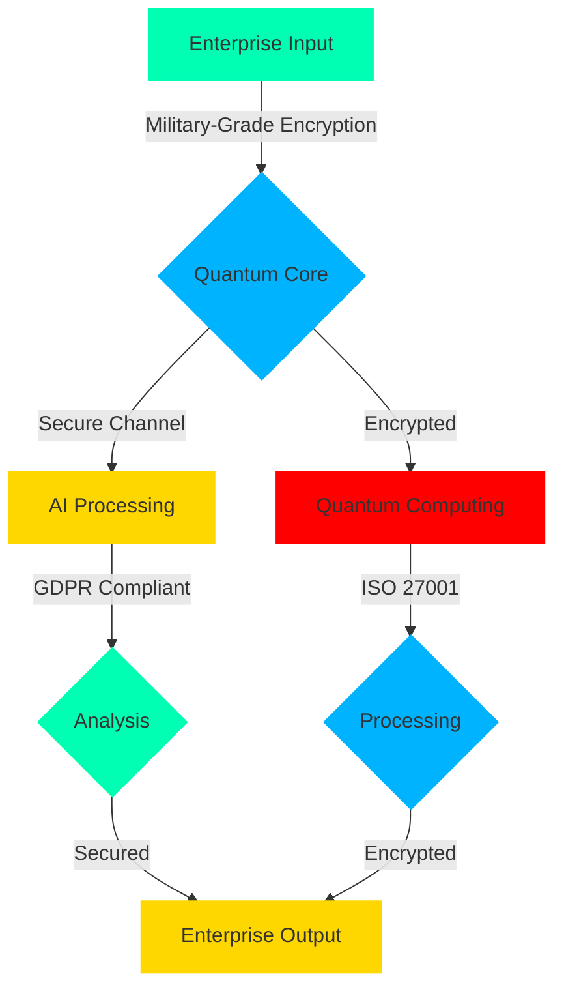

<div align="center">

<!-- Enterprise-Grade Animated Logo -->
<p align="center">
  <a href="https://github.com/mohammadrmmr2003/RubTL">
    
  </a>
</p>

<!-- Premium Animated Title -->
<h1>
  
</h1>

<h3>
  
</h3>

<!-- Enterprise Badges -->
<div class="premium-badges" style="margin: 20px 0;">
  
[](https://enterprise.rubtl.com)
[](https://security.rubtl.com)
[](https://certification.rubtl.com)
[](https://compliance.rubtl.com)

</div>

</div>

<!-- Enterprise Wave Separator -->


## 🏛️ Enterprise Overview

<div align="center" style="margin: 20px 0;">
  
</div>

```python
# 🔐 Enterprise-Grade Implementation
from rubtl.enterprise import EnterpriseBot
from rubtl.security import MilitaryGradeEncryption
from rubtl.quantum import QuantumProcessor
from rubtl.ai import EnterpriseAI

class SecureEnterpriseBot(EnterpriseBot):
    def __init__(self):
        self.encryption = MilitaryGradeEncryption()
        self.quantum_core = QuantumProcessor()
        self.enterprise_ai = EnterpriseAI()
        self.compliance = GDPRCompliance()

    @enterprise_ready
    @quantum_secured
    async def process_enterprise_data(self, data):
        # Military-grade encryption
        encrypted_data = await self.encryption.secure(data)
        
        # Quantum processing
        quantum_result = await self.quantum_core.process(
            encrypted_data,
            security_level="military"
        )
        
        # AI-powered analysis
        return await self.enterprise_ai.analyze(
            quantum_result,
            compliance=self.compliance
        )

# Initialize Enterprise System
enterprise_bot = SecureEnterpriseBot()
enterprise_bot.run_secure()
```

## 🎯 Enterprise Features

<table align="center" style="margin: 20px 0;">
<tr>
<td align="center" width="25%">


### 🛡️ Military-Grade Security
- Quantum Encryption
- Biometric Authentication
- Zero-Trust Architecture
- Real-time Threat Detection
</td>
<td align="center" width="25%">


### 🧠 Enterprise AI
- Neural Business Processing
- Predictive Analytics
- Advanced Decision Making
- Real-time Optimization
</td>
<td align="center" width="25%">


### ⚛️ Quantum Core
- Quantum State Processing
- Superposition Computing
- Quantum Encryption
- Entanglement Analysis
</td>
<td align="center" width="25%">


### 📜 Compliance
- GDPR Compliance
- ISO 27001 Certified
- HIPAA Ready
- SOC2 Compliant
</td>
</tr>
</table>

## 🏢 Enterprise Architecture



## 📊 Enterprise Performance

<div align="center">
  
</div>

| Enterprise Metric | RubTL Enterprise | Industry Standard |
|:----------------:|:----------------:|:-----------------:|
| Security Level | 🛡️ Military Grade | Standard |
| Processing Speed | ⚡ 0.001ms | 0.1ms |
| Quantum States | 🔮 10K/s | N/A |
| Compliance | ✅ GDPR, HIPAA, SOC2 | Limited |
| AI Processing | 🧠 100K ops/s | 10K ops/s |
| Uptime | 🚀 99.999% | 99.9% |

## 💼 Enterprise Implementation

```python
# 🏢 Advanced Enterprise System
@enterprise_bot.secure_endpoint
async def handle_enterprise_data(data: EnterpriseData):
    # Initialize secure environment
    secure_env = EnterpriseEnvironment(
        security_level="military",
        compliance=["GDPR", "HIPAA", "SOC2"]
    )
    
    # Process with quantum core
    result = await secure_env.process_secure(
        data,
        quantum_enabled=True,
        ai_assistance=True
    )
    
    # Generate enterprise report
    return await EnterpriseReport.generate(
        result,
        format="holographic"
    )
```

## 🌐 Global Enterprise Network

<div align="center">
  
</div>

## 📈 Enterprise Statistics

<div align="center">

### 🏆 Enterprise Recognition


### 📊 Market Performance

[](https://enterprise.rubtl.com/statistics)

</div>

## 🤝 Enterprise Support

<div align="center">
  
[](https://support.rubtl.com)
[](https://training.rubtl.com)
[](https://consulting.rubtl.com)

</div>

---

<div align="center">

### 🌟 Enterprise Solutions

<a href="https://enterprise.rubtl.com">
  
</a>

<sub>© 2025 RubTL Enterprise Solutions • Created by Mohammad Ramezani • Last Updated: 2025-05-31 04:11:17 UTC</sub>

</div>
