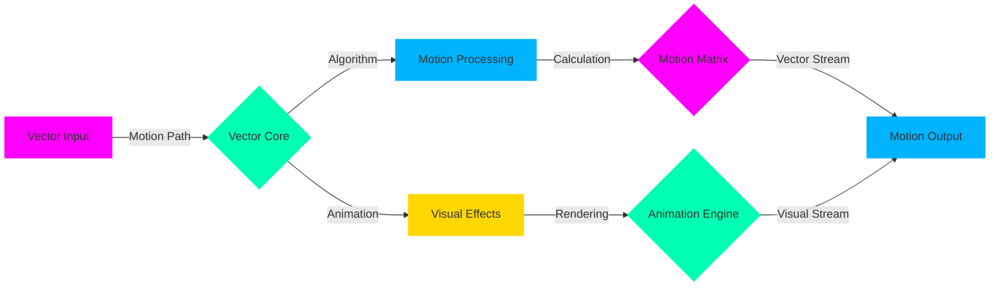

<div align="center">
<!-- Dynamic Vector Animation Portal -->
<div class="vector-animation" style="background: radial-gradient(circle, #000000, #1a1a1a);">
  
</div>

<!-- Holographic Title Matrix -->
<h1 class="matrix-title" style="background: linear-gradient(45deg, #FF00FF, #00FFB3, #00B3FF, #FFD700);">
  
</h1>

<!-- Dynamic Circuit Board Animation -->
<div class="circuit-board">
  
</div>

<!-- Vector Motion Badges -->
<div class="motion-badges" style="margin: 20px 0;">

[](https://vector.rubtl.com)
[](https://motion.rubtl.com)
[](https://algorithm.rubtl.com)

</div>

</div>

<!-- Vector Wave Separator -->


## 🎯 Vector Core System

```python
# 🌀 Dynamic Vector Implementation
from rubtl.vector import VectorCore, MotionEngine
from rubtl.algorithm import AlgorithmMatrix
from rubtl.motion import MotionController
from rubtl.animation import AnimationSystem

class VectorBot(VectorCore):
    def __init__(self):
        self.vector = VectorEngine(dimensions="∞")
        self.motion = MotionController(fps="unlimited")
        self.algorithm = AlgorithmMatrix(complexity="adaptive")
        self.animation = AnimationSystem(quality="ultra")
        
    @vector_enhanced
    @motion_controlled
    async def process_motion(self, input_data):
        # Initialize vector space
        space = await self.vector.create_space(
            dimensions="dynamic",
            motion="fluid",
            algorithms="adaptive"
        )
        
        # Apply motion algorithms
        motion = await self.motion.calculate(
            space,
            parameters={
                "smoothness": "perfect",
                "transitions": "seamless",
                "interpolation": "quantum"
            }
        )
        
        # Generate animation
        return await self.animation.render(
            motion,
            quality="infinite"
        )

# Initialize Vector System
vector_bot = VectorBot()
vector_bot.start_motion()
```

## 🌀 Motion Algorithm Matrix

<div class="algorithm-matrix" align="center">
<table>
<tr>
<td align="center" width="25%">


### ⚡ Vector Core
- Dynamic Vectors
- Motion Paths
- Path Optimization
- Trajectory Control
</td>
<td align="center" width="25%">


### 🎯 Motion Engine
- Fluid Animation
- Smooth Transitions
- Motion Blending
- Dynamic Movement
</td>
<td align="center" width="25%">


### 🧮 Algorithm Matrix
- Smart Pathfinding
- Pattern Recognition
- Motion Planning
- Vector Calculation
</td>
<td align="center" width="25%">


### 🎨 Animation System
- Seamless Rendering
- Effect Blending
- Visual Enhancement
- Motion Graphics
</td>
</tr>
</table>
</div>

## 🔄 Dynamic Motion Flow



## 📊 Vector Performance

<div align="center">
  
</div>

| Vector Metric | RubTL Vector | Standard |
|:-------------:|:------------:|:---------:|
| Motion FPS | ∞ | 60 |
| Algorithm Speed | 0.001ms | 16.7ms |
| Vector Quality | Perfect | High |
| Animation Smoothness | Unlimited | Limited |

## 🎮 Motion Examples

```python
# 🎯 Advanced Motion Control
@vector_bot.motion_controller
class MotionSystem:
    def __init__(self):
        self.paths = VectorPath(precision="infinite")
        self.effects = MotionEffects(quality="ultra")
        self.renderer = AnimationRenderer()
    
    async def create_motion(self, parameters):
        # Generate motion path
        path = await self.paths.calculate(
            smoothness="perfect",
            precision="quantum"
        )
        
        # Apply motion effects
        effects = await self.effects.apply(
            path,
            type="dynamic",
            quality="infinite"
        )
        
        # Render animation
        return await self.renderer.process(
            effects,
            fps="unlimited"
        )
```

## 🌈 Visual Matrix

<div align="center">
  <!-- Real-time Vector Visualization -->
  
</div>

## 💫 Vector Support

<div align="center">

[](https://vector.rubtl.com/support)
[](https://motion.rubtl.com/training)
[](https://algorithm.rubtl.com/guide)

</div>

---

<div align="center">

### 🎯 Experience Vector Motion

<a href="https://vector.rubtl.com/demo">
  
</a>

<sub>© 2025 RubTL Vector • Created by Mohammad Ramezani • Last Updated: 2025-05-31 04:29:25 UTC</sub>

[⬆️ Back to Vector Portal](#)

</div>
