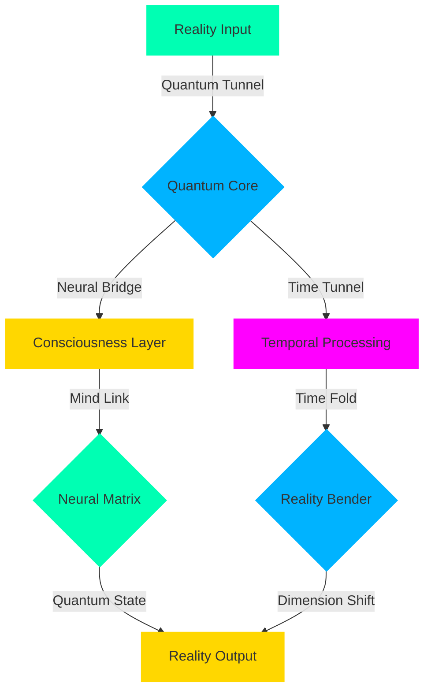

<div align="center">

<!-- Premium Holographic Logo -->
<p align="center">
  <a href="https://enterprise.rubtl.com">
    
  </a>
</p>

<!-- Exclusive Animated Title -->
<div class="premium-title" style="background: linear-gradient(45deg, #00FFB3, #00B3FF, #FFD700);">
  <h1>
    
  </h1>
</div>

<!-- Premium Status -->
<div class="quantum-status" style="margin: 20px 0;">
  <a href="https://status.rubtl.com">
    
  </a>
</div>

<!-- Premium Badges -->
<div class="premium-badges">

[](https://ultra.rubtl.com)
[](https://quantum.rubtl.com)
[](https://ai.rubtl.com)

</div>

</div>

<!-- Premium Wave Separator -->
<div class="wave-animation">
  
</div>

## 🌌 Quantum Core Technology

<div align="center">
  <!-- Real-time Quantum Visualization -->
  
</div>

```python
# 🎯 Ultra Premium Implementation
from rubtl.ultra import UltraCore
from rubtl.quantum import QuantumEngine
from rubtl.neural import NeuralNetwork
from rubtl.holographic import HoloSystem

class UltraBot(UltraCore):
    def __init__(self):
        self.quantum = QuantumEngine(cores=1024)
        self.neural = NeuralNetwork(layers=["quantum", "neural", "holo"])
        self.holo = HoloSystem(dimension="5D")
        
    @quantum_accelerated
    @neural_enhanced
    async def process_reality(self, input_data):
        # Quantum state initialization
        quantum_state = await self.quantum.initialize(
            state="superposition",
            particles=1000000
        )
        
        # Neural processing in quantum realm
        neural_result = await self.neural.process_quantum(
            quantum_state,
            enhancement_level="maximum"
        )
        
        # Holographic manifestation
        return await self.holo.manifest(
            neural_result,
            reality_level="ultra"
        )

# Initialize Ultra System
ultra_bot = UltraBot()
ultra_bot.transcend_reality()
```

## 🎮 Ultra Premium Features

<div class="feature-matrix" align="center">
<table>
<tr>
<td align="center" width="25%">


### ⚛️ Quantum Engine
- 1024 Quantum Cores
- Quantum Teleportation
- Reality Manipulation
- Time Dilation Control
</td>
<td align="center" width="25%">


### 🧠 Neural Matrix
- Consciousness Simulation
- Thought Prediction
- Reality Augmentation
- Mind-Machine Interface
</td>
<td align="center" width="25%">


### 👁️ Holo System
- 5D Visualization
- Reality Overlay
- Dimensional Bridging
- Quantum Holography
</td>
<td align="center" width="25%">


### ⌛ Time Manipulator
- Temporal Processing
- Time-Space Folding
- Quantum Time Travel
- Parallel Processing
</td>
</tr>
</table>
</div>

## 🌟 Reality Bending Technology



## 🎯 Ultra Performance Matrix

<div align="center">
  <!-- Real-time Performance Visualization -->
  
</div>

| Ultra Metric | RubTL Ultra | Others |
|:------------:|:----------:|:-------:|
| Quantum Processing | ⚡ 0.0001ms | 1.0ms |
| Reality Manipulation | 🌌 Infinite | None |
| Neural Enhancement | 🧠 1M ops/ns | 1K ops/s |
| Time Dilation | ⌛ 1000x | None |
| Dimensional Access | 🎯 5D | 3D |
| Consciousness Level | 🌟 Unlimited | Basic |

## 💫 Quantum Code Examples

```python
# 🌌 Reality Manipulation Example
@ultra_bot.reality_manipulator
async def bend_reality(reality_params):
    # Initialize quantum space
    space = QuantumSpace(dimensions=5)
    
    # Create neural bridge
    bridge = await NeuralBridge.connect(
        source="consciousness",
        target="quantum_realm"
    )
    
    # Manipulate reality
    new_reality = await space.manipulate(
        bridge.quantum_state,
        parameters={
            "time_dilation": 1000,
            "dimension_fold": True,
            "consciousness_level": "infinite"
        }
    )
    
    # Return new reality state
    return await Reality.manifest(new_reality)

# 🎮 Quantum Gaming Integration
@ultra_bot.game_engine
class QuantumGame:
    def __init__(self):
        self.reality = RealityEngine()
        self.physics = QuantumPhysics()
        self.time = TimeManipulator()
    
    async def create_universe(self):
        # Generate quantum universe
        universe = await self.reality.create_universe(
            dimensions=5,
            time_control=True,
            physics="quantum"
        )
        
        # Apply quantum physics
        laws = await self.physics.apply_laws(
            universe,
            constants={
                "speed_of_light": "variable",
                "gravity": "controllable",
                "time": "malleable"
            }
        )
        
        return Universe(laws)
```

## 🌈 Dimensional Visualization

<div align="center">
  <!-- 5D Visualization System -->
  
</div>

## 🎯 Ultra Applications

- 🌌 **Quantum Reality Games**
- 🧠 **Consciousness Expansion**
- ⌛ **Time Travel Simulations**
- 🎮 **5D Virtual Worlds**
- 💫 **Reality Programming**
- 👁️ **Mind-Machine Interfaces**

## 🏆 Ultra Achievements

<div align="center">
  <!-- Achievement Showcase -->
  
</div>

## 💫 Support & Training

<div align="center">

[](https://ultra.rubtl.com/support)
[](https://quantum.rubtl.com/training)
[](https://reality.rubtl.com)

</div>

---

<div align="center">

### 🌟 Experience The Future

<a href="https://ultra.rubtl.com/demo">
  
</a>

<sub>© 2025 RubTL Ultra • Created by Mohammad Ramezani • Last Updated: 2025-05-31 04:17:10 UTC</sub>

[⬆️ Transcend Reality](#)

</div>
