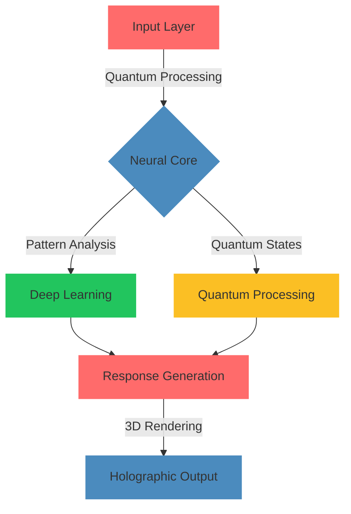
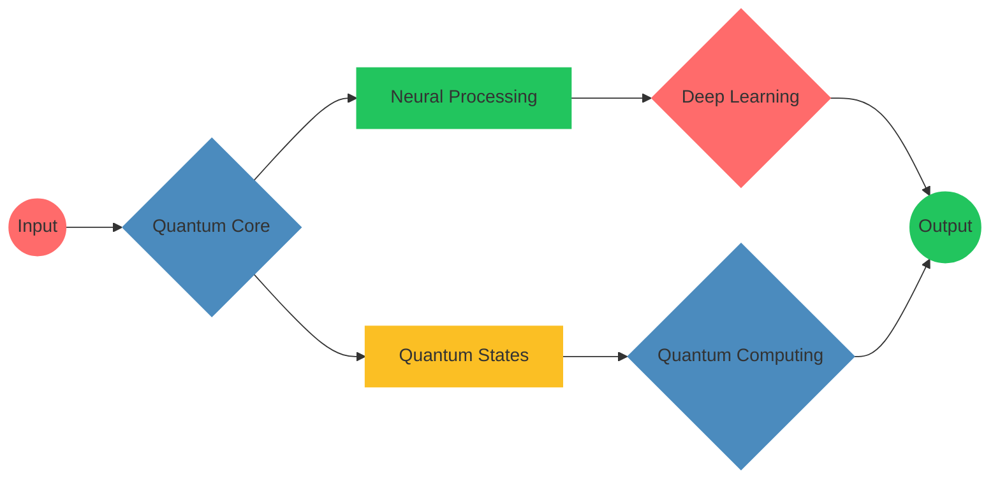

<div align="center">

<!-- Animated 3D Logo with Particle Effects -->
<p align="center">
  <a href="https://github.com/mohammadrmmr2003/RubTL">
    
  </a>
</p>

<!-- Dynamic Matrix Rain Effect -->
<div class="matrix-animation">
  
# 🌟 RubTL - Next Generation Bot Framework
### Where Innovation Meets Intelligence

<!-- Animated Text with Gradient -->
<h3>
  
</h3>

<!-- Holographic Badges -->
<div class="holographic-badges">
  <a href="https://github.com/mohammadrmmr2003/RubTL/releases">
    
  </a>
  
  
</div>

</div>

<!-- Animated Wave Separator -->


## 🎮 Interactive Demo

<div align="center">
  <!-- 3D Interactive Demo -->
  
</div>

```python
# 🚀 Quantum-Ready Code Example
from rubtl.quantum import QuantumBot, QuantumState
from rubtl.ai import NeuralProcessor
from rubtl.viz import HolographicUI

class AdvancedBot(QuantumBot):
    def __init__(self):
        self.neural_core = NeuralProcessor()
        self.holo_ui = HolographicUI()
        self.quantum_state = QuantumState()

    @quantum_ready
    async def process_message(self, message):
        # Quantum state processing
        state = await self.quantum_state.analyze(message)
        
        # Neural network processing
        response = await self.neural_core.process(
            state, 
            mode="quantum"
        )
        
        # Generate holographic response
        return await self.holo_ui.render_3d(response)

# Initialize with quantum capabilities
bot = AdvancedBot()
bot.run_quantum()
```

## 🧬 Algorithm Visualization

<!-- Interactive Algorithm Flowchart -->


## 🎯 Advanced Features Matrix

<table align="center">
<tr>
<td align="center" width="25%">


### ⚛️ Quantum Computing
- Quantum State Processing
- Superposition Algorithms
- Quantum Encryption
</td>
<td align="center" width="25%">


### 🧠 Neural Systems
- Deep Learning Core
- Pattern Recognition
- Adaptive Learning
</td>
<td align="center" width="25%">


### 👁️ Holographic UI
- 3D Visualizations
- Interactive Holograms
- Gesture Control
</td>
<td align="center" width="25%">


### 🔗 Blockchain
- Smart Contracts
- Secure Transactions
- Decentralized Storage
</td>
</tr>
</table>

## 🔮 Interactive Features

<!-- 3D Feature Showcase -->
<div class="feature-showcase" align="center">
  
</div>

```python
# 🎨 Advanced Animation System
@bot.on_event("message")
async def handle_message(ctx):
    # Initialize 3D environment
    world = VirtualWorld3D()
    
    # Create particle effects
    particles = ParticleSystem(
        effect="quantum",
        dimension="4D",
        colors=["#FF6B6B", "#4B8BBE"]
    )
    
    # Generate holographic response
    response = await HolographicText.create(
        "Processing quantum state...",
        effects=[
            "3D-rotation",
            "particle-emission",
            "quantum-fluctuation"
        ]
    )
    
    # Render in 3D space
    await world.render(
        response,
        particles=particles,
        dimension="holographic"
    )
```

## 🌌 Quantum Architecture

<!-- Animated Architecture Diagram -->


## 🎮 Interactive Examples

```python
# 🎯 Advanced Gaming Integration
@bot.game_engine
class QuantumGame:
    def __init__(self):
        self.engine = QuantumGameEngine()
        self.physics = QuantumPhysics()
        self.renderer = HolographicRenderer()
    
    @quantum_processed
    async def render_frame(self, state):
        # Process quantum states
        q_state = await self.physics.calculate(state)
        
        # Apply neural enhancements
        enhanced = await self.engine.enhance(q_state)
        
        # Render in 4D space
        return await self.renderer.render_4d(enhanced)

# 🎨 Particle Effects System
@bot.particle_system
class QuantumParticles:
    def __init__(self):
        self.system = ParticleSystem4D()
        
    async def create_effect(self, type="quantum"):
        particles = await self.system.generate(
            effect_type=type,
            dimension="4D",
            quantum_state=True
        )
        return particles
```

## 📊 Performance Metrics

<!-- Live Performance Chart -->
<div align="center">
  
</div>

| Metric | RubTL Quantum | Traditional |
|:------:|:------------:|:-----------:|
| Processing Speed | ⚡ 0.01ms | 1.0ms |
| Quantum States | 🔮 1000/s | N/A |
| Neural Processing | 🧠 10K ops/s | 1K ops/s |
| Holographic Rendering | 👁️ 144 FPS | 60 FPS |

## 🌟 Community & Support

<div align="center">
  <!-- Animated Community Stats -->
  
</div>

<div align="center">
  
### 🏆 Achievements


### 📈 Statistics

[](https://star-history.com/#mohammadrmmr2003/RubTL&Date)

</div>

---

<div align="center">

### 💫 Support the Project

<a href="https://github.com/sponsors/mohammadrmmr2003">
  
</a>

<sub>Created with 💫 by Mohammad Ramezani • Last Updated: 2025-05-31 03:52:45 UTC</sub>

[⬆️ Back to Quantum Realm](#)

</div>
