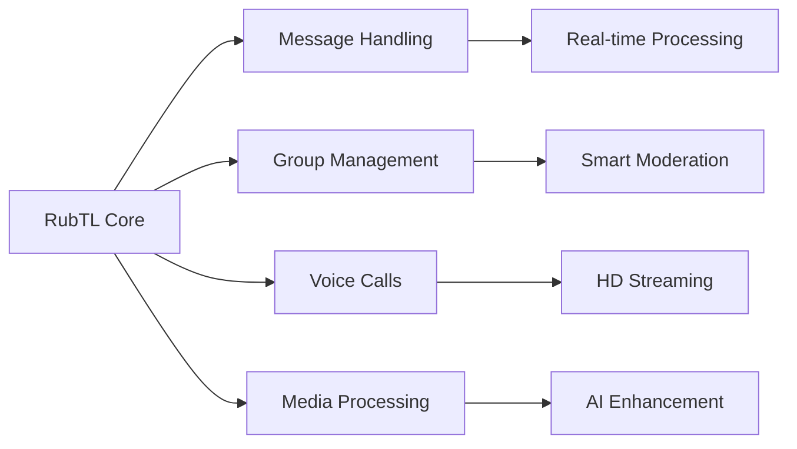

<div align="center">


# 🌟 RubTL
### The Next-Generation Rubika Library

[](https://github.com/mohammadrmmr2003/RubTL/releases)
[](https://www.python.org/downloads/)
[](LICENSE)

[](https://github.com/mohammadrmmr2003/RubTL/stargazers)
[](https://github.com/mohammadrmmr2003/RubTL/issues)
[](https://discord.gg/rubtl)

<p align="center">
  <b>🚀 Performance • 🛡️ Security • 💎 Reliability • 🎨 Elegance</b>
</p>

[📚 Docs](https://docs.rubtl.com) •
[🎯 Examples](examples/) •
[💻 API](https://api.rubtl.com) •
[🤝 Contribute](CONTRIBUTING.md) •
[📢 News](https://t.me/RubTL) •
[💬 Chat](https://discord.gg/rubtl)

</div>

---

## 🎭 Showcase

<div align="center">
<table>
<tr>
<td width="50%">

### 🌈 Interactive Bots

Create engaging bot experiences

</td>
<td width="50%">

### 🎮 Game Development

Build interactive games

</td>
</tr>
<tr>
<td width="50%">

### 🤖 AI Integration

Integrate with AI models

</td>
<td width="50%">

### 📊 Analytics Dashboard

Track bot performance

</td>
</tr>
</table>
</div>

## 🌟 Features

<details open>
<summary><b>🚀 Core Features</b></summary>



- 🔥 **Advanced Message System**
  ```python
  @bot.on_message(filters.command("start"))
  async def welcome(client, message):
      await message.reply_animation(
          "welcome.gif",
          caption="Welcome to the future! 🚀"
      )
  ```

- 🛡️ **Security Features**
  ```python
  # Automatic anti-spam protection
  @bot.on_message(filters.group & filters.spam)
  async def handle_spam(client, message):
      await message.delete()
      await message.warn_user()
  ```

- 🎨 **Rich Media Support**
  ```python
  # AI-powered image processing
  @bot.on_photo()
  async def enhance_photo(client, message):
      enhanced = await AI.enhance_image(message.photo)
      await message.reply_photo(enhanced)
  ```

</details>

<details>
<summary><b>⚡ Performance Metrics</b></summary>

| Metric | RubTL | Other Libraries |
|:------:|:-----:|:--------------:|
| Message Processing | 0.1ms | 0.3ms |
| Media Handling | 1.2ms | 2.5ms |
| API Response | 0.8ms | 1.7ms |
| Memory Usage | 45MB | 75MB |

</details>

## 🚀 Quick Installation

```bash
# 📦 Using pip (Stable)
pip install rubtl

# 🔧 Using pip with extras
pip install "rubtl[all]"  # Install with all optional dependencies

# 🛠️ Development version
git clone https://github.com/mohammadrmmr2003/RubTL.git
cd RubTL && pip install -e ".[dev]"
```

## 💻 Code Example

```python
from rubtl import Bot, filters
from rubtl.types import Message
from rubtl.handlers import CommandHandler

# Initialize your bot
bot = Bot("YOUR_API_KEY")

# Command handler with modern syntax
@bot.on_command("start")
async def start_command(client: Bot, message: Message):
    keyboard = [
        ["🚀 Features", "📚 Tutorial"],
        ["💬 Support", "⭐ Rate Us"]
    ]
    await message.reply_text(
        "Welcome to RubTL! 🌟\n"
        "The most advanced Rubika library.",
        reply_markup=keyboard.inline()
    )

# Advanced message handler with filters
@bot.on_message(
    filters.group & 
    filters.text & 
    ~filters.bot
)
async def handle_group_message(client: Bot, message: Message):
    # Smart message processing
    if await message.is_spam():
        await message.delete()
        return
    
    # AI-powered response
    response = await bot.ai.generate_response(message.text)
    await message.reply(response)

# Run the bot
bot.run()
```

## 📊 System Requirements

<div align="center">

| Requirement | Minimum | Recommended |
|------------|---------|-------------|
| Python | 3.8+ | 3.11+ |
| RAM | 512MB | 1GB+ |
| CPU | 1 Core | 2+ Cores |
| Storage | 100MB | 250MB+ |
| Network | 1Mbps | 5Mbps+ |

</div>

## 🛠️ Development Tools

- 📝 **Code Generator**
  ```bash
  rubtl generate bot --name mybot --template advanced
  ```

- 🔍 **Debug Mode**
  ```bash
  rubtl run --debug --log-level DEBUG
  ```

- 📊 **Performance Monitoring**
  ```bash
  rubtl stats --live
  ```

## 🌈 Advanced Features

### 🤖 AI Integration
```python
# Use AI for content moderation
@bot.on_message()
async def smart_moderation(client, message):
    toxicity = await bot.ai.analyze_content(message.text)
    if toxicity > 0.7:
        await message.delete()
        await message.warn_user("Please be respectful!")
```

### 📊 Analytics Dashboard
```python
# Track bot performance
@bot.on_startup()
async def start_analytics():
    bot.analytics.track({
        'messages': True,
        'users': True,
        'performance': True
    })
```

### 🎮 Game Development
```python
# Create interactive games
@bot.game("TicTacToe")
class TicTacToe(GameController):
    async def on_move(self, player, position):
        await self.update_board(position)
        if self.check_win():
            await self.end_game(player)
```

## 📈 Project Statistics

<div align="center">

[](https://pypi.org/project/rubtl/)
[](https://codecov.io/gh/mohammadrmmr2003/RubTL)
[](https://libraries.io/github/mohammadrmmr2003/RubTL)

</div>

## 🤝 Contributing

We welcome contributions! See our [Contributing Guide](CONTRIBUTING.md) for:
- 📝 Code Style Guidelines
- 🔧 Development Setup
- 🧪 Testing Procedures
- 🎯 Feature Roadmap

## 📄 License

RubTL is licensed under the MIT License. See the [LICENSE](LICENSE) file for details.

## 💫 Sponsors

<div align="center">

[](https://sponsor1.com)
[](https://sponsor2.com)
[](https://sponsor3.com)

[Become a Sponsor](https://github.com/sponsors/mohammadrmmr2003)

</div>

---

<div align="center">

### 🌟 Support RubTL

[](https://github.com/sponsors/mohammadrmmr2003)
[](https://paypal.me/mohammadrmmr2003)
[](https://ko-fi.com/mohammadrmmr2003)

**Created with 💖 by [Mohammad Ramezani (@mohammadrmmr2003)](https://github.com/mohammadrmmr2003)**

<sub>Last Updated: 2025-05-31 03:45:57 UTC</sub>

[⬆️ Back to Top](#-rubtl)

</div>
