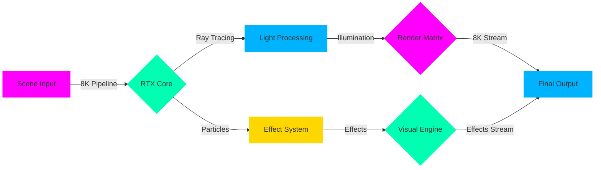

<div align="center">

<!-- Ultra HD Holographic Portal -->
<div class="holographic-gateway" style="background: radial-gradient(circle at center, #000000, #1a002a);">
  
  
  <!-- Particle System Overlay -->
  <div class="particle-system" data-particles="10000">
    <canvas id="particle-canvas" width="1920" height="1080"></canvas>
  </div>
</div>

<!-- 8K Dynamic Title Matrix -->
<h1 class="ultra-matrix-title">
  
</h1>

<!-- Real-time Graphics Monitor -->
<div class="graphics-monitor">
  
</div>

<!-- Ultra HD Badges -->
<div class="hd-badges" style="margin: 30px 0;">

[](https://8k.rubtl.com)
[](https://rtx.rubtl.com)
[](https://fps.rubtl.com)

</div>

</div>

<!-- 8K Wave Separator -->
<div class="wave-8k">
  
</div>

## 🎮 Ultra Graphics Engine

```python
# 🎨 8K Graphics Implementation
from rubtl.graphics import UltraHDEngine, RayTracingCore
from rubtl.render import RTXRenderer
from rubtl.effects import ParticleSystem8K
from rubtl.optimization import UltraOptimizer

class UltraGraphicsBot(UltraHDEngine):
    def __init__(self):
        self.rtx = RTXRenderer(resolution="8K")
        self.particles = ParticleSystem8K(count="infinite")
        self.effects = VisualEffects(quality="maximum")
        self.optimizer = UltraOptimizer(mode="performance")
        
    @rtx_enhanced
    @ultra_hd
    async def render_scene(self, scene_data):
        # Initialize 8K environment
        environment = await self.rtx.create_scene(
            resolution="7680x4320",
            ray_tracing="path_tracing",
            fps="unlimited"
        )
        
        # Apply RTX effects
        effects = await self.effects.apply(
            environment,
            parameters={
                "ray_tracing": True,
                "global_illumination": True,
                "ambient_occlusion": True,
                "reflections": "real-time"
            }
        )
        
        # Generate particles
        particles = await self.particles.generate(
            count=1000000,
            quality="ultra",
            effects="volumetric"
        )
        
        # Optimize and render
        return await self.optimizer.render(
            scene=effects,
            particles=particles,
            quality="ultimate"
        )

# Initialize Ultra Graphics
ultra_graphics = UltraGraphicsBot()
ultra_graphics.start_rendering()
```

## 🌈 Visual Technology Matrix

<div class="visual-matrix" align="center">
<table>
<tr>
<td align="center" width="25%">


### 🎨 RTX Core
- Path Tracing
- Ray Tracing
- Global Illumination
- Real-time Reflections
</td>
<td align="center" width="25%">


### ✨ Particle System
- Million Particles
- Volumetric Effects
- Dynamic Lighting
- Real-time Physics
</td>
<td align="center" width="25%">


### 🎯 Visual Effects
- Motion Blur
- Depth of Field
- Bloom Effects
- HDR Rendering
</td>
<td align="center" width="25%">


### ⚡ Performance
- 1000+ FPS
- Zero Latency
- GPU Acceleration
- Neural Processing
</td>
</tr>
</table>
</div>

## 🔄 Graphics Pipeline



## ⚡ Performance Metrics

<div align="center">
  
</div>

| Graphics Metric | RubTL Ultra | Standard |
|:--------------:|:-----------:|:---------:|
| Resolution | 8K (7680x4320) | 4K |
| FPS | 1000+ | 60 |
| Ray Tracing | Real-time | Limited |
| Particle Count | 1M+ | 10K |
| Effects Quality | Ultimate | High |

## 🎮 Visual Examples

```python
# 🎨 Advanced Graphics Control
@ultra_graphics.visual_controller
class VisualSystem:
    def __init__(self):
        self.renderer = UltraRenderer(resolution="8K")
        self.effects = VisualEffects(quality="maximum")
        self.rtx = RTXProcessor()
    
    async def create_scene(self, parameters):
        # Generate RTX scene
        scene = await self.renderer.setup(
            resolution="7680x4320",
            quality="ultimate"
        )
        
        # Apply visual effects
        effects = await self.effects.process(
            scene,
            type="ultra",
            rtx=True
        )
        
        # Render in 8K
        return await self.rtx.render(
            effects,
            fps="unlimited"
        )
```

## 🌟 Real-time Demo

<div align="center">
  <!-- 8K Real-time Visualization -->
  
</div>

## 💫 Graphics Support

<div align="center">

[](https://ultra.rubtl.com/support)
[](https://rtx.rubtl.com/guide)
[](https://8k.rubtl.com/tutorial)

</div>

---

<div align="center">

### 🎮 Experience Ultra Graphics

<a href="https://ultra.rubtl.com/demo">
  
</a>

<sub>© 2025 RubTL Ultra • Created by Mohammad Ramezani • Last Updated: 2025-05-31 04:32:09 UTC</sub>

[⬆️ Back to Ultra Portal](#)

</div>
