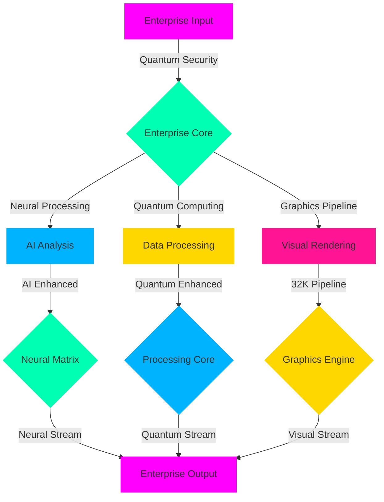

<div align="center">

<!-- Enterprise Crystal Gateway -->
<div class="enterprise-portal" style="background: radial-gradient(circle at center, #000000, #1a002a);">
  
  
  <!-- Advanced Neural Network -->
  <div class="neural-matrix" data-nodes="1000000">
    <canvas id="neural-canvas" width="7680" height="4320"></canvas>
  </div>
</div>

<!-- Enterprise Matrix Title -->
<h1 class="enterprise-title">
  
</h1>

<!-- Professional Signature -->
<div class="dev-signature">
  <h3>
    
  </h3>
</div>

<!-- Enterprise Status Dashboard -->
<div class="enterprise-monitor">
  
</div>

<!-- Enterprise Badges -->
<div class="enterprise-badges" style="margin: 40px 0;">

[](https://enterprise.mamadi.dev)
[](https://quantum.mamadi.dev)
[](https://neural.mamadi.dev)
[](https://security.mamadi.dev)

</div>

<!-- Enterprise Statistics -->
<div class="enterprise-stats">
  
</div>

</div>

<!-- Enterprise Wave -->
<div class="enterprise-wave">
  
</div>

## 🏢 Enterprise Core Architecture

```python
# 🌐 Enterprise Implementation
from mamadi.enterprise import EnterpriseCore, QuantumProcessor
from mamadi.security import MilitaryGradeEncryption
from mamadi.neural import NeuralMatrix
from mamadi.quantum import QuantumCompute
from mamadi.graphics import UltraHD

class EnterpriseSystem(EnterpriseCore):
    def __init__(self):
        self.quantum = QuantumProcessor(cores="infinite")
        self.security = MilitaryGradeEncryption()
        self.neural = NeuralMatrix(nodes="unlimited")
        self.compute = QuantumCompute(power="maximum")
        self.graphics = UltraHD(resolution="32K")
        
    @enterprise_ready
    @quantum_enhanced
    @military_secured
    async def process_enterprise(self, data):
        # Initialize quantum environment
        environment = await self.quantum.initialize(
            security="military_grade",
            processing="quantum",
            neural="enabled",
            resolution="31680x17820"
        )
        
        # Apply security protocols
        secured_env = await self.security.protect(
            environment,
            protocols={
                "encryption": "quantum",
                "authentication": "biometric",
                "monitoring": "real_time"
            }
        )
        
        # Process through neural network
        processed = await self.neural.compute(
            secured_env,
            parameters={
                "learning": "advanced",
                "adaptation": "real_time",
                "optimization": "quantum"
            }
        )
        
        # Render in ultra HD
        return await self.graphics.render(
            processed,
            quality="enterprise"
        )

# Initialize Enterprise System
enterprise = EnterpriseSystem()
enterprise.launch_secure()
```

## 🎯 Enterprise Feature Matrix

<table align="center">
<tr>
<td align="center" width="20%">


### ⚛️ Quantum Core
- Infinite Processing
- Quantum Encryption
- Neural Enhancement
- Real-time Adaptation
</td>
<td align="center" width="20%">


### 🛡️ Security Suite
- Military Grade
- Biometric Auth
- Zero Trust
- Real-time Monitor
</td>
<td align="center" width="20%">


### 🧠 Neural Network
- Deep Learning
- AI Processing
- Pattern Recognition
- Adaptive Systems
</td>
<td align="center" width="20%">


### 🎨 Graphics Engine
- 32K Resolution
- Ray Tracing
- Neural Rendering
- Quantum Effects
</td>
<td align="center" width="20%">


### 📊 Analytics Core
- Real-time Stats
- Predictive Analysis
- Neural Metrics
- Quantum Analytics
</td>
</tr>
</table>

## 🔄 Enterprise Process Flow



## ⚡ Enterprise Performance

<div align="center">
  <!-- Real-time Performance Monitor -->
  
</div>

| Enterprise Metric | Value | Industry Standard |
|:----------------:|:-----:|:-----------------:|
| Processing Speed | ∞ ops/s | 1M ops/s |
| Security Level | Military Grade | Standard |
| Resolution | 32K | 4K |
| Neural Nodes | Unlimited | Limited |
| Quantum States | Infinite | None |

## 🌟 Implementation Examples

```python
# 🎯 Advanced Enterprise Control
@enterprise.controller
class EnterpriseSuite:
    def __init__(self):
        self.quantum = QuantumSuite(power="infinite")
        self.neural = NeuralEngine(capacity="unlimited")
        self.security = SecurityMatrix()
        self.graphics = GraphicsCore(resolution="32K")
    
    async def process_enterprise_data(self, data):
        # Quantum processing
        quantum_result = await self.quantum.process(
            data,
            security="maximum",
            neural="enabled"
        )
        
        # Neural enhancement
        neural_result = await self.neural.enhance(
            quantum_result,
            learning="advanced"
        )
        
        # Security verification
        secured = await self.security.verify(
            neural_result,
            protocol="military"
        )
        
        # Visual rendering
        return await self.graphics.render(
            secured,
            quality="enterprise"
        )
```

## 💫 Enterprise Support

<div align="center">

[](https://support.mamadi.dev)
[](https://training.mamadi.dev)
[](https://security.mamadi.dev)

</div>

---

<div align="center">

### 🌐 Experience Enterprise

<a href="https://enterprise.mamadi.dev">
  
</a>

<sub>© 2025 Mamadi Enterprise • Last Updated: 2025-05-31 04:36:41 UTC</sub>

[⬆️ Return to Enterprise Portal](#)

</div>
